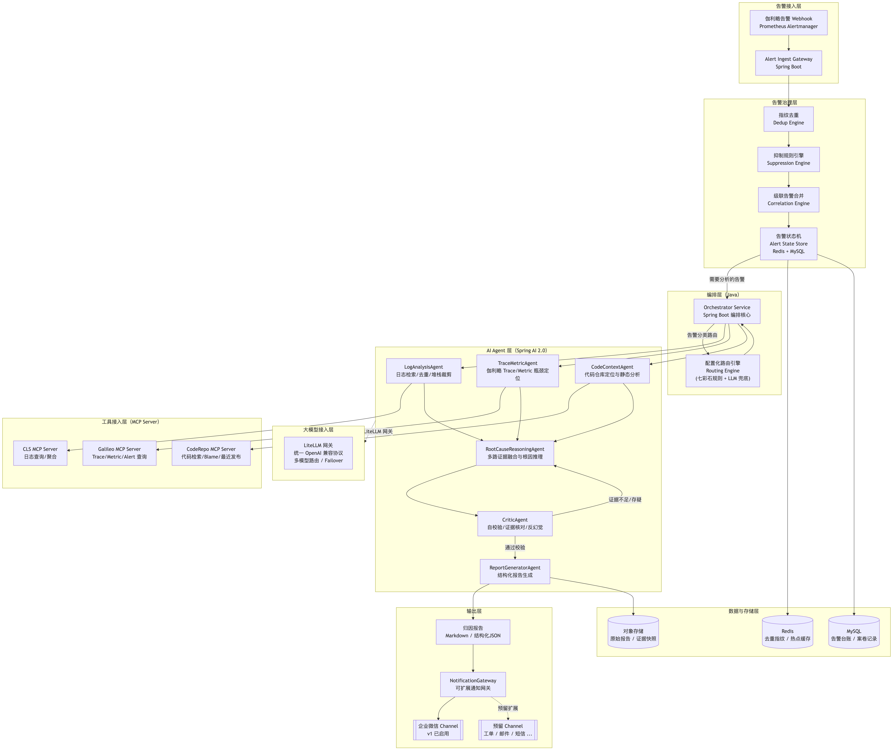
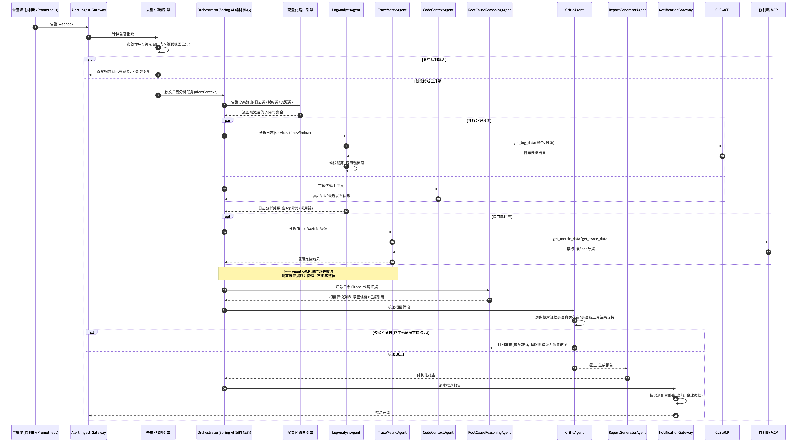

# AI 告警自动归因分析系统 —— 架构设计文档

状态：设计评审中
适用范围：Java 业务服务的生产告警自动归因（CLS 日志 + 伽利略 Trace/Metric）
文档定位：**系统层面的顶层概览**，聚焦整体架构、模块划分、系统边界、核心业务流程与非功能性架构要求，不涉及具体技术选型理由、接口定义、数据结构、算法实现等细节。技术细节见配套的《[02-详细设计文档](02-详细设计文档.md)》。

---

## 1. 背景与目标

### 1.1 现状痛点

- 业务日志集中在腾讯云 **CLS**，Trace/Metric 集中在**伽利略**监控系统，两套系统数据不互通，需要人工在两个系统间来回切换查证。
- 告警触发后，人工需要：登录 CLS 查日志 → 人工去重海量重复异常 → 在堆栈中肉眼剔除框架代码找到业务代码行 → 结合经验梳理调用链 → 猜测根因 → 如果怀疑是接口慢，再切到伽利略看 Metric/Trace → 反复交叉验证。整个过程**平均耗时 15~40 分钟**，且高度依赖个人经验，新人难以复制资深 SRE 的排查路径。
- 相似故障重复发生时，历史排查经验无法被自动复用，每次都要"从零排查"（本期暂不做自动化案例检索，作为后续迭代方向）。
- 告警本身存在**风暴问题**：一次故障往往在短时间内触发数十条同根因的重复告警，进一步消耗人工精力。

### 1.2 系统目标

1. **自动化**：告警触达后，系统在**无人工介入**的情况下完成日志检索、去重聚类、堆栈裁剪、调用链梳理、Metric/Trace 分析、根因推理、报告生成的全链路。
2. **可解释、可验证**：报告中的每一条结论都必须能追溯到具体的日志样本 / Trace / Metric 证据，杜绝"AI 一本正经地编造"。
3. **降噪**：具备告警抑制、指纹去重、级联告警合并能力，避免故障期间被告警风暴淹没。
4. **可控成本与可控延迟**：一次归因分析在合理的 Token 成本和时间（目标 < 2 分钟出初步报告）内完成。
5. **面向 Java 生态团队**：技术栈以 Java 为主，AI 能力优先使用 Spring AI 2.0，流程编排由 Java Orchestrator 负责、告警分类路由用七彩石配置化规则，大模型统一通过团队现有的 LiteLLM 网关接入（选型理由见详细设计文档）。
6. **第一版聚焦必要功能**：优先打通日志与 Metric/Trace 两条核心分析链路，历史相似案例检索等锦上添花的能力留待后续迭代评估。

### 1.3 系统边界

**输入边界**：
- 告警事件：伽利略告警 Webhook、Prometheus Alertmanager Webhook 等标准告警源。
- 分析所需数据：通过 MCP 协议从 CLS（业务日志）、伽利略（Trace/Metric）、代码仓库（业务代码上下文）拉取，系统本身不存储或托管这些原始数据。

**输出边界**：
- 结构化归因报告（Markdown + 结构化 JSON）。
- 报告推送：当前仅推送至企业微信群，推送渠道设计为可扩展（见第 2.3 节、详细设计文档第 3 章）。

**依赖的外部系统**（系统边界之外，本项目不改造，仅作为消费方接入）：
- 腾讯云 CLS（日志查询）、伽利略监控（Trace/Metric/Alert 查询）、LiteLLM 大模型网关、七彩石配置中心、代码仓库（工蜂/GitHub）、企业微信（消息推送）、TKE/MySQL/Redis/COS 等基础设施。

**本期不做（非目标）**：
- 不做自动化的故障自愈/自动回滚/自动扩容等**变更操作**，只输出建议，不执行变更。
- 不追求 100% 替代人工决策，最终止损/复盘决策仍需人工确认，系统定位为"资深 SRE 的智能副驾"。
- 不做历史相似案例检索（RAG），留作后续迭代方向。
- 第一版不引入 Dify 等外部工作流引擎，编排全部由 Java Orchestrator 承担（评估过程见详细设计文档 §1.4）；也不设置报告推送前的人工审批环节，报告生成后直接推送。

---

## 2. 总体架构

### 2.1 架构分层图

> 图片源文件：`diagrams/architecture-overview.mmd`（Mermaid 源码，可用 `mermaid-cli` 重新渲染，或在支持 Mermaid 的编辑器中查看/编辑）。

架构自上而下分为七层：告警接入层、告警治理层、编排层、AI Agent 层、工具接入层（MCP）、大模型接入层、数据与存储层，以及独立的输出层。各层职责见第 2.3 节模块划分表；各层内部组件的技术选型与实现细节见《详细设计文档》。

### 2.2 核心设计理念

1. **多 Agent 分工、单点推理**：证据收集类 Agent（日志/Trace/代码）各司其职、并行执行；只有 `RootCauseReasoningAgent` 做跨证据融合推理，避免"多个 Agent 各自臆测、互相污染"。
2. **工具即事实边界（Tool-Grounded）**：所有 LLM 结论必须基于 MCP 工具返回的结构化数据，Agent 不允许在没有工具调用结果支撑的情况下输出"事实性陈述"，这是防幻觉的核心机制（→ 详见详细设计文档第 4 章）。
3. **编排与推理统一在 Java 内**：第一版由 Java `Orchestrator Service` 统一承担流程编排（告警分类路由→并行证据收集→根因推理→Critic 校验循环→报告分发），不引入外部工作流引擎；告警分类路由规则以七彩石配置化管理，可不发版调整。这样保证核心链路强类型、可测试、可容错（异常处理策略见详细设计文档第 7 章），也避免了跨系统编排带来的状态割裂与链路复杂度。
4. **证据链贯穿始终**：每一步 Agent 输出都带可追溯引用（指向原始日志 ID / TraceID / Span ID / Metric 查询条件），最终报告可逐条点击追溯到原始数据。
5. **关键环节均可插拔扩展**：AI Agent（新增分析维度只需新增 Agent）、MCP 工具（新增数据源只需新增 MCP Server）、报告推送渠道（新增渠道只需新增 Channel 实现）均以插件化方式设计，核心链路不因扩展而改动。

### 2.3 核心模块划分

| 层级 | 模块 | 核心职责（一句话） | 详细设计参考 |
|---|---|---|---|
| 告警接入层 | Alert Ingest Gateway | 接收各类告警 Webhook，归一化为内部告警上下文 | 详细设计文档 §6 |
| 告警治理层 | Dedup Engine | 计算告警指纹，识别重复告警 | 详细设计文档 §6.1 |
| 告警治理层 | Suppression Engine | 按多策略规则抑制不需要分析的告警 | 详细设计文档 §6.2 |
| 告警治理层 | Correlation Engine | 基于调用链拓扑做级联告警因果合并 | 详细设计文档 §6.2 |
| 编排层 | Orchestrator Service | 统一编排：告警分类路由、驱动多 Agent 并行证据收集、Critic 校验循环、报告分发、异常隔离与降级 | 详细设计文档 §2.2、§7 |
| 编排层 | Routing Engine | 基于七彩石配置化规则 + LLM 兜底做告警分类路由，决定激活哪些 Agent | 详细设计文档 §6.3 |
| AI Agent 层 | LogAnalysisAgent | CLS 日志检索、去重聚类、堆栈裁剪、调用链梳理 | 详细设计文档 §2.1、§5 |
| AI Agent 层 | TraceMetricAgent | 伽利略 Metric/Trace 分析，定位性能瓶颈 | 详细设计文档 §2.1 |
| AI Agent 层 | CodeContextAgent | 结合日志/Trace 线索定位代码与配置隐患 | 详细设计文档 §2.1 |
| AI Agent 层 | RootCauseReasoningAgent | 融合多路证据做根因推理 | 详细设计文档 §2.1、§2.3 |
| AI Agent 层 | CriticAgent | 对根因结论做自校验、反幻觉审查 | 详细设计文档 §4.3 |
| AI Agent 层 | ReportGeneratorAgent | 生成结构化归因报告 | 详细设计文档 §3.1 |
| 工具接入层 | MCP Server 集群 | 统一封装 CLS/伽利略/代码仓库的查询能力 | 详细设计文档 §1.2 |
| 大模型接入层 | LiteLLM 网关 | 统一大模型调用协议、多模型路由与 Failover | 详细设计文档 §1.2 |
| 输出层 | NotificationGateway | 可扩展的报告推送网关（当前仅启用企业微信渠道） | 详细设计文档 §3.2 |
| 数据与存储层 | MySQL / Redis / COS | 告警台账、去重状态、证据快照持久化 | 详细设计文档 §9 |

---

## 3. 核心业务流程

### 3.1 主流程（时序图）

> 图片源文件：`diagrams/main-sequence.mmd`。

流程概述：告警到达后先经过指纹去重与抑制规则判断，若命中抑制规则则直接归并不再分析；否则由 Java Orchestrator 启动分析任务，先经配置化路由引擎做告警分类，再并行调度日志、代码上下文等证据收集 Agent，按需触发 Trace/Metric 分析，汇总证据后交由根因推理 Agent 生成假设，经反幻觉校验 Agent 审核通过后生成报告并直接推送（无人工审批环节）。整个流程中任一 Agent 或数据源发生超时/失败时会被隔离并降级处理，不阻塞整体（策略见详细设计文档第 7 章）。

### 3.2 业务处理分支概览

不同类型的告警会走向不同的分析重点，具体规则判断逻辑与实现机制见详细设计文档：

| 场景 | 触发条件 | 处理重点 |
|---|---|---|
| CLS 异常日志阈值告警 | 日志异常数/异常率超阈值 | 以日志分析为主：聚类去重、堆栈裁剪、调用链梳理 |
| 接口耗时高/上游调用超时 | P95/P99 耗时、超时率异常 | 日志分析 + Trace/Metric 瓶颈定位联合分析 |
| JVM/资源类告警 | GC、内存、CPU throttling、线程数异常 | 以 Metric 分析为主，结合实例维度判断问题范围 |
| 数据库/Redis 异常 | 日志或 Trace 命中 DB/Redis 关键词 | 日志给出候选依赖，Metric 补充依赖侧证据 |
| 无明显日志异常但指标异常 | 日志聚类无 Top 类别 | 转为以 Trace 采样分析为主导 |

> 分支判断的具体实现方式（规则引擎 + LLM 语义判断双通道）见详细设计文档第 6.3 节。

### 3.3 报告与推送（概览）

系统最终产出结构化、可追溯的归因报告，核心信息包括：一句话根因结论、置信度、影响范围、关键证据链、时间线、调用链视图、根因假设排序、建议动作、待确认项。报告生成后经由可扩展的通知网关推送，当前仅启用企业微信渠道。

> 报告详细分区模板与推送渠道的接口设计见详细设计文档第 3 章。

---

## 4. 非功能性架构要求

系统作为生产环境的辅助决策服务，需满足以下架构层面的非功能性要求（具体落地方案见详细设计文档第 8 章，异常容错专项见第 7 章）：

1. **自身可观测**：系统需要像监控其他生产服务一样被监控，覆盖处理延迟、各阶段耗时、外部依赖调用成功率、模型调用成本、结论准确率等维度。
2. **成本可控**：单次分析的模型调用成本需要被约束在合理范围内，避免告警风暴场景下成本失控。
3. **安全合规**：涉及业务日志/Trace 的敏感信息需要脱敏处理；外部系统访问凭证需要统一托管，不硬编码。
4. **健壮性与容错**：分析流程涉及多个 Agent、多个外部数据源（CLS/伽利略/代码仓库）和 LLM 调用，任一节点发生异常、超时或失败时，系统必须能够捕获、隔离该异常，并采取重试、降级或兜底策略，绝不因单点失败导致整体分析崩溃或无限阻塞。这是本系统作为"故障期间被依赖的工具"的底线要求（详细策略见详细设计文档第 7 章）。
5. **性能与弹性**：需要应对告警风暴场景下的突发流量，核心分析路径需要异步化、并行化设计；单次分析端到端延迟目标控制在分钟级。
6. **可扩展性**：AI Agent、工具数据源、报告推送渠道、大模型均需支持后续独立扩展，扩展时不应影响已有核心链路（见第 2.2 节设计理念）。

---

## 5. 部署架构

- 全组件容器化部署于 TKE，按微服务拆分：`alert-gateway`（告警接入+治理）、`rca-orchestrator`（编排服务 + 路由引擎 + 全部 Agent，作为同一 Spring Boot 应用内的不同 Bean，初期不拆分为独立微服务以降低运维复杂度）、`report-service`（内置 NotificationGateway）。
- LiteLLM 网关复用团队现有部署实例。
- MCP Server：CLS/伽利略 MCP 已有现成接入方式，代码仓库 MCP 为本项目新增。
- 配置中心（七彩石）统一管理告警分类路由规则、抑制规则、堆栈裁剪规则、模型路由配置、通知渠道配置，支持热更新。

---

## 6. 演进路线图（Roadmap）

| 阶段 | 目标 | 关键交付 |
|---|---|---|
| M1（MVP） | 打通 CLS 日志类告警的端到端归因 | 告警接入、去重抑制基础版、LogAnalysisAgent、RootCauseReasoningAgent、CriticAgent 基础校验、NotificationGateway + 企微 Channel |
| M2 | 支持接口耗时类告警 | TraceMetricAgent、Metric/Trace 联合分析、级联告警合并 |
| M3 | 代码上下文深度分析 | CodeContextAgent、发布记录关联、配置隐患检测 |
| M4 | 规模化与自优化 | 告警分类路由规则开放给 SRE 自助配置（七彩石）、人工反馈驱动的 Prompt/规则迭代、多业务线接入、按需评估历史相似案例检索（RAG）能力是否引入、按需评估是否引入 Dify 等可视化编排（若届时流程复杂度确有需要） |

---

## 7. 评审结论（架构层面）

1. **流程编排方案**：第一版不引入 Dify 等外部工作流引擎，编排全部由 Java Orchestrator 承担，告警分类路由用七彩石配置化规则，同时移除报告推送前的人工审批环节（评估过程见详细设计文档 §1.4）。
2. **DB/Redis 监控接入位**：第一版即为 `TraceMetricAgent` 预留 DB/Redis 监控 MCP 的接入位，当前架构在 CLS + 伽利略两类数据源基础上，扩展预留 DB/Redis 监控 MCP Server 的接入能力（工具接入层的插件化设计天然支持后续新增该数据源，见第 2.2 节设计理念）。

> 技术选型层面的评审结论（LiteLLM 模型能力确认、企微接入方式等）见详细设计文档第 10 章。
