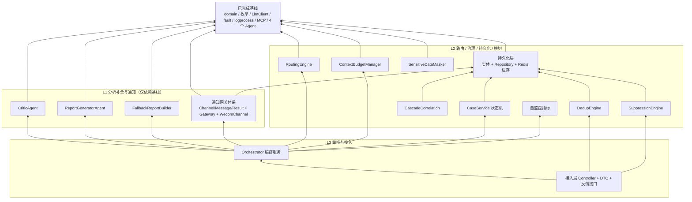

# AI 告警自动归因分析系统 —— 待开发模块任务清单

文档定位：**编码路线图**。基于《[02-详细设计文档](02-详细设计文档.md)》与当前已实现代码，逐项列出**尚未开发**的原子功能模块，每个模块以统一"任务卡"给出模块名称、功能描述、输入/输出参数、依赖关系、约束条件与验收要点，供后续 Agent 按依赖顺序逐个原子化实现，确保互不冲突、无缝集成。

> 本清单只覆盖第一版范围。**不包含**历史相似案例检索（RAG）、Dify 编排、人工审批（三者均已在评审中确认第一版不做）。

---

## 0. 实现进度（已按清单完成，共新增 41 个文件）

> 本轮已按 L1→L2→L3 依赖顺序完成清单全部原子模块的编码。IDE 语言服务诊断 0；`mvn checkstyle:check` 全量通过（0 违规）。

| 层 | 模块 | 状态 | 主要新增类 |
|---|---|---|---|
| L1-1 | CriticAgent | ✅ | `agent/CriticAgent`、`agent/CriticLlmOutput` |
| L1-2 | ReportGeneratorAgent | ✅ | `agent/ReportGeneratorAgent`、`agent/SuggestedActionOutput` |
| L1-3 | FallbackReportBuilder | ✅ | `report/FallbackReportBuilder` |
| L1-4 | 通知网关体系 | ✅ | `notify/NotificationChannel`、`NotificationMessage`、`NotificationResult`、`NotificationGateway`、`WecomChannel` |
| L2-5 | 持久化层 | ✅ | `repository/entity/{AlertCase,SuppressionRule,NotificationRecord}Entity`、三 `Repository`、`repository/cache/RcaCacheService`、枚举 `SendStatus`/`SuppressionRuleType` |
| L2-1 | RoutingEngine | ✅ | `routing/RoutingEngine`、`routing/RouteDecision`、`routing/RouteLlmOutput` |
| L2-2 | ContextBudgetManager | ✅ | `context/ContextBudgetManager` |
| L2-3 | SensitiveDataMasker | ✅ | `security/SensitiveDataMasker` |
| L2-4 | MapReduceSummarizer | ✅ | `context/MapReduceSummarizer` |
| L2-6 | DedupEngine | ✅ | `governance/DedupEngine`、`governance/DedupResult` |
| L2-7 | SuppressionEngine | ✅ | `governance/SuppressionEngine`、`governance/SuppressionResult` |
| L2-8 | CascadeCorrelation | ✅ | `governance/CascadeCorrelation`、`governance/CascadeResult` |
| L2-9 | CaseService | ✅ | `governance/CaseService` |
| L2-10 | 自监控指标 | ✅ | `observability/RcaMetrics` |
| L3-1 | Orchestrator | ✅ | `orchestrator/Orchestrator` |
| L3-2 | 接入层 Controller + DTO | ✅ | `api/RcaController`、`api/dto/{AnalyzeRequest,AnalyzeResponse,CaseView,FeedbackRequest,FeedbackVerdict}` |
| L3-3 | EvidenceArchiveService | ✅ | `archive/EvidenceArchiveService` |

**与任务卡的合理化调整（已记录）**：

1. 去重/抑制与案卷创建在接入层（`RcaController`）完成并得到 `caseId`，`Orchestrator` 对外方法调整为 `analyzeAsync(Long caseId, AlertContext alert)`（对齐"编排只针对已建案卷执行分析、步骤 6 更新状态"的语义）。
2. 并行 Fan-out 采用虚拟线程 `Executors.newVirtualThreadPerTaskExecutor()` + `Future.get(超时)` 的"允许部分失败"策略，规避 JDK 21 预览版 `StructuredTaskScope`，效果等价。
3. `RootCauseReasoningAgent.reason(EvidenceBundle)` 无打回原因入参，故 Critic 校验循环的"带原因重推理"以"重推理 + 超轮次/超时强制降级置信度"落地，不改动既有 Agent。
4. `SensitiveDataMasker` 与 `ContextBudgetManager` 在 `Orchestrator.refineBundle` 中真正串联：先脱敏证据文本（保留 `sourceRef` 以维持 Critic 引用校验），再按 token 预算全局裁剪后重建 `EvidenceBundle`。
5. `EvidenceArchiveService`（COS）第一版返回本地占位 URL；`report_url` 回填待 COS 接入后开启（M2/增强）。

**环境说明**：本机仅有 JDK 8（默认）与 JDK 17，项目 `pom` 目标为 JDK 21（虚拟线程），因此 `mvn compile/package` 需在 JDK 21 环境执行；checkstyle 仅解析源码，已用 JDK 17 成功运行并通过。

---

## 1. 使用说明

1. **按顺序实现**：模块已按依赖自底向上分为 L1 / L2 / L3 三层，同层内模块可任意顺序或并行。**下层未就绪时不要开工上层**（会因缺少注入 Bean 无法编译）。
2. **一次一卡**：每轮对话实现一张任务卡对应的模块，实现后跑 lint 确认 0 问题再进入下一张。
3. **复用优先**：凡是"可依赖项"中已存在的领域 record、枚举、配置、能力组件，**直接注入/引用，禁止重复造型**。任务卡中标注 `[新增]` 的才需要新建类。
4. **契约以设计文档为准**：每张卡标注了对应的详细设计文档章节号（如 §4.3），实现细节有疑问时回查该章节。

---

## 2. 已完成基线一览（可依赖项）

以下 43 个文件已实现并通过 lint，任务卡可直接依赖：

| 包 | 已完成类 | 说明 |
|---|---|---|
| `common.enums` | `AlertSource`、`AlertType`、`CaseStatus`、`ChannelType`、`ConfidenceLevel`、`EvidenceSourceType` | `CaseStatus`=OPEN/ANALYZING/ANALYZED/ANALYZE_FAILED/ACKNOWLEDGED/RESOLVED/FALSE_POSITIVE/CASCADED；`ChannelType`=WECOM/EMAIL/SMS/TICKET |
| `common.exception` | `RcaException` | 业务异常基类 |
| `config` | `AppConfig`、`RcaProperties`、`McpProperties`、`NotifyProperties` | 配置见 §3 字段速查 |
| `domain` | `AlertContext`、`TimeWindow`、`Evidence`、`LogAnalysisResult`、`TraceMetricResult`、`CodeContextResult`、`EvidenceBundle`、`RootCauseHypothesis`、`ReasoningResult`、`CriticResult`、`RcaReport` | 均为 record，字段见 §3 |
| `fault` | `RetryExecutor`、`TimeLimiter`、`RetryableException`、`TimeLimitExceededException` | 重试+超时能力，容错基石 |
| `llm` | `LlmClient`、`ModelTier` | `complete(tier,sys,user)` / `completeStructured(tier,sys,user,Class<T>)`；`ModelTier`=REASONING/LIGHTWEIGHT |
| `logprocess` | `LogFingerprintService`、`StackTracePruner` | 指纹归一化压缩(§5.2)、堆栈裁剪(§5.3) |
| `mcp` | `McpClient`、`ClsMcpClient`、`GalileoMcpClient`、`CodeRepoMcpClient` | 三路数据源客户端已闭环 |
| `agent` | `LogAnalysisAgent`、`TraceMetricAgent`、`CodeContextAgent`、`RootCauseReasoningAgent`（含各自 `*Insight`/`ReasoningLlmOutput` 契约） | 三路证据收集 + 根因推理已就绪 |
| `resources` | `application.yml`、`db/schema.sql`、`config/checkstyle/checkstyle.xml` | 三张表 DDL 已存在 |

### 关键领域模型字段速查（任务卡输入/输出直接引用）

- `AlertContext(alertId, serviceName, env, alertSource, alertType, timeWindow, fingerprint, rawAlertPayload)`
- `TimeWindow(start, end)`
- `Evidence(description, type/*EvidenceSourceType*/, sourceRef, rawSnippet)`
- `LogAnalysisResult(topExceptionCategories, prunedCallChain, suspectedDependency, evidences, degraded, degradeNote)`
- `TraceMetricResult(bottleneckType, metricSummary, topSlowSpans, evidences, degraded, degradeNote)`
- `CodeContextResult(riskPoints, recentChanges, evidences, degraded, degradeNote)`
- `EvidenceBundle(alertContext, Optional<LogAnalysisResult>, Optional<TraceMetricResult>, Optional<CodeContextResult>)`，提供 `allEvidences()`、`hasAnyEvidence()`
- `RootCauseHypothesis(summary, confidence, supportingEvidence, counterEvidenceOrGaps)`
- `ReasoningResult(hypotheses, impactScope)`
- `CriticResult(passed, rejectReasons)`
- `RcaReport(caseId, serviceName, conclusion, confidence, impactScope, hypotheses, timeline, callChainView, suggestedActions, pendingItems, degradeNote, fallback, markdownBody)`，内含 `TimelineItem(time, event)`

### 关键配置字段速查（任务卡复用而非新建）

- `RcaProperties.llm`：`reasoningModel`、`lightweightModel`、`maxRetries`、`selfConsistencySamples`
- `RcaProperties.timeout`：`mcpCallMs=10000`、`agentMs=30000`、`llmCallMs=30000`、`criticLoopMs=20000`、`overallMs=120000`
- `RcaProperties.dedup`：`cooldownSeconds=600`
- `RcaProperties.critic`：`maxIterations=2`
- `RcaProperties.contextBudget`：`reasoningAgentTokens=12000`、`criticAgentTokens=8000`、`evidenceAgentTokens=6000`
- `RcaProperties.stackPruning`：`businessPackages`、`frameworkPackages`
- `NotifyProperties.wecom`：`enabled`、`webhookUrl`、`maxRetries=3`

### 已建表（无需重复建，实体/Repository 需新增）

- `alert_case`（含 `fingerprint`、`service_name`、`alert_source`、`status`、`first_seen_at`、`last_seen_at`、`merged_alert_count`、`root_cause_case_id`、`root_cause_summary`、`confidence_level`、`degrade_note`、`report_url`、`version` 乐观锁）
- `suppression_rule`（`rule_type`、`match_condition` JSON、`effective_start/end`、`enabled`、`created_by`）
- `notification_record`（`case_id`、`channel_type`、`send_status`、`fail_reason`、`retry_count`、`sent_at`）

---

## 3. 依赖拓扑图

---

## 4. 全局约束条件（所有任务卡默认继承）

1. **注释与标点**：代码注释使用中文，标点使用英文（逗号、句号等半角）。
2. **Checkstyle**：满足项目 `config/checkstyle/checkstyle.xml`（行长上限、禁止 star import、禁止未使用 import、常量 `UPPER_SNAKE`、每个 public 类型/方法需 Javadoc）。实现后必须跑 lint 直至 0 问题。
3. **无死代码**：不得有未使用的方法参数、私有方法、import 或字段。若设计上暂不使用某入参，删除它而非保留。
4. **复用优先**：优先复用既有 `domain` record、枚举、`RcaProperties`/`NotifyProperties`/`McpProperties` 配置、`RetryExecutor`/`TimeLimiter`/`LlmClient`，禁止重复定义等价类型。
5. **防幻觉对称性**（Agent 类模块）：与既有 `LogAnalysisAgent`/`RootCauseReasoningAgent` 保持一致——事实性数据由本地确定性代码产出，LLM 只做语义判断；能用代码校验的绝不交给 LLM；每条 `Evidence` 必须带可追溯 `sourceRef`。
6. **容错对称性**：外部调用（MCP/LLM/HTTP）统一经 `RetryExecutor` + `TimeLimiter` 封装；单点失败隔离、降级须显式标注（写入 `degradeNote`），异常不静默吞没。
7. **构造器注入**：Spring Bean 一律构造器注入（`final` 字段），不使用 `@Autowired` 字段注入。
8. **不越界**：不实现 RAG / Dify / 人工审批相关任何代码。

---

## 5. 任务卡统一字段模板

> 每个模块严格套用以下字段：**模块名称（含包路径 + [新增]/[复用]标注）· 功能描述（+ 章节号）· 输入参数 · 输出参数 · 依赖关系 · 约束条件 · 验收要点**。

---

## 6. L1 层任务卡（仅依赖已完成基线，可立即开工）

### L1-1 · `CriticAgent`

- **模块名称**：`com.tencent.rca.agent.CriticAgent` [新增]（可选新增 `CriticLlmOutput` 契约 [新增]）
- **功能描述**：对 `RootCauseReasoningAgent` 的输出做反幻觉自校验（§4.3、§4.4）。**程序化硬校验优先**，LLM 语义校验兜底。
- **输入参数**：`CriticResult verify(ReasoningResult reasoning, EvidenceBundle bundle)`
- **输出参数**：复用 `CriticResult(passed, rejectReasons)`
- **依赖关系**：`LlmClient`（仅语义校验用 `ModelTier.REASONING`）
- **约束条件**：
  - 硬校验（代码，非 LLM）：① 每条 `hypothesis.supportingEvidence()` 的 `sourceRef` 必须存在于 `bundle.allEvidences()` 的 sourceRef 集合（`Set` 包含判断），否则打回；② 置信度与证据数量匹配——单一支撑证据却标 `HIGH` 强制视为不合规并打回，要求降级；③ 逻辑冲突检测（同为高置信度却互相矛盾）。
  - LLM 语义校验：核对证据 `description` 与 `rawSnippet` 是否被曲解，仅做语义判断。
  - 校验不通过时 `passed=false` 且 `rejectReasons` 给出**具体可操作**的打回原因（供 `RootCauseReasoningAgent` 二次推理）。
  - LLM 调用异常不在此吞没，交由 Orchestrator 处理（§7.4：Critic 失败则跳过深度校验、保留硬校验、置信度不高于 MEDIUM）。
- **验收要点**：硬校验全部用代码实现；无未使用参数；lint 0；与既有 Agent 风格对称。

### L1-2 · `ReportGeneratorAgent`

- **模块名称**：`com.tencent.rca.agent.ReportGeneratorAgent` [新增]
- **功能描述**：将校验通过的推理结果与证据渲染为最终归因报告（§2.1、§3.1），同时产出结构化字段与 `markdownBody`。
- **输入参数**：`RcaReport generate(Long caseId, AlertContext alert, ReasoningResult reasoning, EvidenceBundle bundle, String degradeNote)`
- **输出参数**：复用 `RcaReport`（填充 conclusion/confidence/impactScope/hypotheses/timeline/callChainView/suggestedActions/pendingItems/degradeNote/markdownBody，`fallback=false`）
- **依赖关系**：`LlmClient`（仅用于建议动作/结论润色等语义生成，可选；证据链、调用链视图、时间线由本地组装）
- **约束条件**：
  - `conclusion` 取 `reasoning.hypotheses()` 首个假设的 summary；`confidence` 取首个假设置信度；`impactScope` 取 `reasoning.impactScope()`。
  - `callChainView` 来自 `logResult.prunedCallChain()`；`timeline` 由告警时间窗 + 证据信息本地对齐组装为 `TimelineItem` 列表。
  - 报告七大分区（结论卡片/证据链/时间线/调用链/假设排序/建议动作/待确认项）齐全；每条证据在 Markdown 中附 `sourceRef`。
  - 低置信度须在 `pendingItems` 列出待确认项，不强行下结论。
  - 报告不含"历史相似案例"分区。
- **验收要点**：Markdown 与结构化字段一致；无裸结论（证据均可追溯）；lint 0。

### L1-3 · `FallbackReportBuilder`

- **模块名称**：`com.tencent.rca.report.FallbackReportBuilder` [新增]
- **功能描述**：分析无法正常完成时（整体超时 / LLM 完全不可用 / 三路证据源全失败）产出兜底报告（§7.6），保证不静默失败。
- **输入参数**：`RcaReport buildFallback(Long caseId, AlertContext alert, EvidenceBundle partialBundle, String failReason)`
- **输出参数**：复用 `RcaReport`（`fallback=true`，`conclusion="系统未能完成自动归因, 请人工排查"`，`confidence=LOW`，`degradeNote=failReason`）
- **依赖关系**：无（纯本地渲染，**不依赖 LLM**）
- **约束条件**：兜底报告须包含告警原文摘要 + 已成功采集到的证据快照（`partialBundle.allEvidences()`，哪怕为空）+ 失败原因说明；案卷状态由调用方置为 `ANALYZE_FAILED`。
- **验收要点**：无任何外部调用；输入证据为空时也能正常渲染；lint 0。

### L1-4 · 通知网关体系（一组）

- **模块名称**（一组 [新增]）：
  - `com.tencent.rca.notify.NotificationChannel`（接口）
  - `com.tencent.rca.notify.NotificationMessage`（record）
  - `com.tencent.rca.notify.NotificationResult`（record）
  - `com.tencent.rca.notify.NotificationGateway`（Bean）
  - `com.tencent.rca.notify.WecomChannel`（Bean，实现 `NotificationChannel`）
- **功能描述**：报告推送的可扩展网关（§3.2），第一版仅实现企业微信群机器人 Webhook 渠道。
- **接口/契约定义**（对齐 §3.2）：
  - `NotificationChannel`：`ChannelType channelType();` `NotificationResult send(NotificationMessage message);`
  - `NotificationMessage(String caseId, String title, String summary, ConfidenceLevel confidence, String reportUrl, String markdownBody)`
  - `NotificationResult(boolean success, String failReason)`
- **输入/输出**：
  - `NotificationGateway.dispatch(NotificationMessage msg, List<ChannelType> channels)` → 逐渠道调用并落库 `notification_record`
  - `WecomChannel.send(NotificationMessage)` → `NotificationResult`
- **依赖关系**：`NotifyProperties`（`wecom.webhookUrl/enabled/maxRetries`）、`RetryExecutor`（推送失败指数退避，最多 `maxRetries` 次）、`notification_record` Repository（L2 持久化层；若持久化层尚未就绪，可先注入接口留桩，但**建议持久化层先行**）
- **约束条件**：
  - `NotificationGateway` 用 `Map<String, NotificationChannel>` 或按 `channelType()` 建索引路由；支持一次分发多个渠道，单渠道失败不影响其他渠道。
  - 推送失败落 `send_status=FAILED` + 失败原因，触发自监控告警，**绝不阻塞归因主流程**（报告已生成即视为分析成功）。
  - `WecomChannel` 将 `NotificationMessage` 转为企微 markdown 消息体；置信度做视觉区分（高绿/中黄/低红）。
  - 其余渠道（EMAIL/SMS/TICKET）第一版不实现。
- **验收要点**：新增渠道只需新增一个 `NotificationChannel` 实现且不改 Gateway；lint 0。

---

## 7. L2 层任务卡

### L2-1 · `RoutingEngine`

- **模块名称**：`com.tencent.rca.routing.RoutingEngine` [新增]（可新增 `RouteDecision` record [新增]）
- **功能描述**：告警分类路由（§6.3），决定本次激活哪些证据收集 Agent。规则引擎 + LLM 轻量兜底双通道。
- **输入参数**：`RouteDecision route(AlertContext alert)`
- **输出参数**：`RouteDecision(Set<String> activatedAgents, boolean llmSuggestedReview, String note)`（`activatedAgents` 如 `{LogAnalysisAgent, CodeContextAgent}`，耗时类追加 `TraceMetricAgent`）
- **依赖关系**：`LlmClient`（`ModelTier.LIGHTWEIGHT` 兜底分类）、`RcaProperties`
- **约束条件**：
  - 规则通道基于 `alertType`/监控项名做确定性匹配；第一版规则可先本地配置化（预留后续迁七彩石），规则参考 `diagnosis-flow.md` 决策树。
  - 规则命中优先；规则无法匹配才走 LLM 兜底；二者冲突以规则为准并置 `llmSuggestedReview=true`。
  - 完全无法分类时回退默认策略：至少激活 `LogAnalysisAgent`（§7.4）。
- **验收要点**：默认兜底路径覆盖；lint 0。

### L2-2 · `ContextBudgetManager`

- **模块名称**：`com.tencent.rca.context.ContextBudgetManager` [新增]
- **功能描述**：上下文 Token 预算控制（§5.5），组装 Prompt 前对候选证据按重要性评分裁剪。
- **输入参数**：`List<Evidence> prune(List<Evidence> candidates, int tokenBudget)`
- **输出参数**：裁剪后的 `List<Evidence>`（附截断摘要提示）
- **依赖关系**：`RcaProperties.contextBudget`（各角色 token 预算）
- **约束条件**：
  - 重要性评分因子：异常占比、与告警时间吻合度、证据类型权重。
  - 按评分降序累加 token 预估，超预算截断；剩余低分证据仅保留统计摘要，不展开详情。
  - 纯本地确定性算法，不依赖 LLM；"精度优先于覆盖度"。
- **验收要点**：token 预估方法明确；空输入安全；lint 0。

### L2-3 · `SensitiveDataMasker`

- **模块名称**：`com.tencent.rca.security.SensitiveDataMasker` [新增]
- **功能描述**：进入 LLM 上下文前对敏感字段脱敏（§8.3），扩展 §5.2 的归一化规则。
- **输入参数**：`String mask(String text)`
- **输出参数**：脱敏后的文本
- **依赖关系**：无（正则规则库，可与 `LogFingerprintService` 规则风格一致）
- **约束条件**：覆盖手机号、身份证、密钥/token 等；确定性正则，不依赖 LLM；规则可配置化。
- **验收要点**：常见敏感模式覆盖；lint 0。

### L2-4 · Map-Reduce 摘要（可选后置）

- **模块名称**：`com.tencent.rca.context.MapReduceSummarizer` [新增]
- **功能描述**：Trace 等大数据量场景的分层摘要（§5.4），Map 分批局部摘要 + Reduce 全局汇总。
- **输入参数**：`String summarize(List<String> chunks)`
- **输出参数**：全局摘要文本
- **依赖关系**：`LlmClient`（`ModelTier.LIGHTWEIGHT` 做 Map 阶段）
- **约束条件**：单次调用上下文规模受控；**优先级低**，第一版可后置，`TraceMetricAgent` 数据量可控时不必先做。
- **验收要点**：分批逻辑正确；lint 0。

### L2-5 · 持久化层（一组）

- **模块名称**（一组 [新增]）：
  - 实体：`com.tencent.rca.repository.entity.AlertCaseEntity`、`SuppressionRuleEntity`、`NotificationRecordEntity`
  - 仓储：`AlertCaseRepository`、`SuppressionRuleRepository`、`NotificationRecordRepository`（Spring Data JPA）
  - 缓存：`com.tencent.rca.repository.cache.RcaCacheService`（Redis）
- **功能描述**：三张已建表的持久化映射 + Redis 缓存服务（§6.1、§7.7）。
- **输入/输出**：
  - `AlertCaseRepository`：按 `fingerprint` 查活跃案卷、状态乐观锁更新（`version`）。
  - `RcaCacheService`：判重指纹（key=fingerprint，TTL=`dedup.cooldownSeconds`）；Agent 中间结果缓存（key=`caseId+agentName`，带 TTL，支持重入复用，§7.7）。
- **依赖关系**：Spring Data JPA / Redis Starter（pom 已含则复用）、`RcaProperties.dedup`
- **约束条件**：
  - 实体字段与 `schema.sql` 严格一致；`alert_case.version` 用 `@Version` 乐观锁。
  - 缓存序列化方式统一；key 命名规范化。
- **验收要点**：字段映射与 DDL 一致；乐观锁生效；lint 0。

### L2-6 · `DedupEngine`

- **模块名称**：`com.tencent.rca.governance.DedupEngine` [新增]
- **功能描述**：告警指纹去重（§6.1），短窗内同指纹归并到同一案卷。
- **输入参数**：`DedupResult check(AlertContext alert)`
- **输出参数**：`DedupResult(boolean isNew, Long caseId)`（新建 or 归并到既有案卷）
- **依赖关系**：`RcaCacheService`（Redis 判重）、`AlertCaseRepository`、`RcaProperties.dedup`
- **约束条件**：指纹 `hash(service + alertRuleId + dimensionLabels)`；命中活跃案卷则追加时间线并返回归并，不重复触发分析；否则建新案卷写 Redis + MySQL。
- **验收要点**：指纹算法确定；并发下判重正确；lint 0。

### L2-7 · `SuppressionEngine`

- **模块名称**：`com.tencent.rca.governance.SuppressionEngine` [新增]
- **功能描述**：告警抑制（§6.2），时间窗/维护窗/依赖屏蔽/静默条件。
- **输入参数**：`SuppressionResult evaluate(AlertContext alert)`
- **输出参数**：`SuppressionResult(boolean suppressed, String ruleType)`
- **依赖关系**：`SuppressionRuleRepository`
- **约束条件**：规则来自 `suppression_rule` 表（`match_condition` JSON）；匹配维护窗/屏蔽列表/静默时段则抑制并标注类型；被抑制告警不触发分析。
- **验收要点**：各抑制类型覆盖；规则解析健壮；lint 0。

### L2-8 · `CascadeCorrelation`

- **模块名称**：`com.tencent.rca.governance.CascadeCorrelation` [新增]
- **功能描述**：级联根因合并（§6.2），基于调用链拓扑将同源故障合并为一个根因案卷。
- **输入参数**：`CascadeResult correlate(List<AlertCaseEntity> activeCasesInWindow)`
- **输出参数**：`CascadeResult(Long rootCaseId, List<Long> cascadedCaseIds)`
- **依赖关系**：`GalileoMcpClient`（拉 `caller_server`/`callee_server` 构建调用关系图）、`AlertCaseRepository`
- **约束条件**：构建有向调用图 → 找上游收敛点 → 仅对最上游根因服务触发深度分析，其余置 `CASCADED` 关联根因案卷。调用链数据缺失时安全降级为"不合并"。
- **验收要点**：图构建与收敛判断正确；数据缺失不抛异常；lint 0。

### L2-9 · `CaseService`（案卷状态机）

- **模块名称**：`com.tencent.rca.governance.CaseService` [新增]
- **功能描述**：案卷 CRUD 与状态流转（§6.1、§7.7）。
- **输入/输出**：创建案卷、按 caseId 查询、状态推进（`OPEN→ANALYZING→ANALYZED/ANALYZE_FAILED→ACKNOWLEDGED→RESOLVED/FALSE_POSITIVE`）、写入根因摘要/报告地址/降级说明。
- **依赖关系**：`AlertCaseRepository`
- **约束条件**：状态流转经乐观锁（`version`）保证并发安全；幂等——已 `ANALYZED`/`ANALYZE_FAILED` 的不回退。
- **验收要点**：非法状态流转被拒；乐观锁冲突处理；lint 0。

### L2-10 · 自监控指标

- **模块名称**：`com.tencent.rca.observability.RcaMetrics` [新增]
- **功能描述**：系统自身可观测指标（§8.1、§7.8），Micrometer 埋点。
- **输入/输出**：提供计数/计时 API，供各模块上报：MCP/LLM 调用失败率与超时率、Agent 降级率、兜底报告触发次数、推送失败率、各阶段耗时、Critic 打回率。
- **依赖关系**：`MeterRegistry`（Micrometer）
- **约束条件**：指标命名规范统一前缀（如 `rca_`）；埋点不侵入业务异常流。
- **验收要点**：关键指标齐全；lint 0。

---

## 8. L3 层任务卡（依赖上层大部分模块）

### L3-1 · `Orchestrator`（编排服务）

- **模块名称**：`com.tencent.rca.orchestrator.Orchestrator`（+ 内部 `OrchestrationContext` 等辅助 [新增]）
- **功能描述**：第一版流程编排唯一承载者（§2.2、§7 全章），串联路由→并行证据收集→根因推理→Critic 校验循环→报告生成→分发，并施加统一容错。
- **输入参数**：`String analyze(AlertContext alert)`（返回 caseId；异步执行）
- **输出参数**：无同步产物；产出落库案卷 + 报告 + 触发推送
- **核心流程与约束**：
  1. 经 `RoutingEngine` 得激活 Agent 集合。
  2. 虚拟线程 `StructuredTaskScope` **并行 Fan-out** 调用 `LogAnalysisAgent`/`TraceMetricAgent`/`CodeContextAgent`，采用"允许部分失败"策略（非 `ShutdownOnFailure`），单 Agent 失败隔离并置对应 `Optional` 为空（§7.1、§7.4）。
  3. 组装 `EvidenceBundle`；经 `ContextBudgetManager` 裁剪证据。
  4. `RootCauseReasoningAgent.reason()` → `CriticAgent.verify()` **校验循环**（最多 `critic.maxIterations` 轮，打回则带原因重新推理；超轮次/超 `criticLoopMs` 强制降级为低置信度）。
  5. `ReportGeneratorAgent.generate()` 产出报告；`hasAnyEvidence()==false` 或 LLM 完全不可用或整体超 `overallMs` 时走 `FallbackReportBuilder` 兜底（案卷置 `ANALYZE_FAILED`）。
  6. 经 `CaseService` 更新案卷状态，`NotificationGateway` 分发报告。
  7. 全程分层超时（§7.2）、异常隔离降级（§7.4）、幂等与中间结果缓存复用（§7.7）、指标上报（§8.1）。
- **依赖关系**：`RoutingEngine`、`ContextBudgetManager`、三路证据 Agent、`RootCauseReasoningAgent`、`CriticAgent`、`ReportGeneratorAgent`、`FallbackReportBuilder`、`CaseService`、`RcaCacheService`、`NotificationGateway`、`RcaMetrics`、`RcaProperties`
- **约束条件**：任一环节失败不得导致整体崩溃或无限阻塞；降级必写 `degradeNote`；绝不为"看起来完整"而强行给确定性结论。
- **验收要点**：部分数据源失败仍能出报告；三路全失败走兜底；超时可中断；lint 0。

### L3-2 · 接入层 Controller + DTO

- **模块名称**（一组 [新增]）：
  - `com.tencent.rca.api.RcaController`
  - DTO：`AnalyzeRequest`、`AnalyzeResponse`、`CaseView`、`FeedbackRequest`
- **功能描述**：对外 REST 接入（§2.2、§4.6）。
- **接口清单**：
  - `POST /api/rca/analyze` → 202，返回 `{caseId, status:"ANALYZING"}`（先经 `DedupEngine`/`SuppressionEngine` 治理，再异步交 `Orchestrator`）。
  - `GET /api/rca/cases/{caseId}` → 返回案卷/报告视图。
  - `POST /api/rca/cases/{caseId}/resend` → 手动补推（§7.5）。
  - `POST /api/rca/cases/{caseId}/feedback` → 人工反馈（准确/部分准确/不准确，§4.6）。
- **输入/输出**：`AnalyzeRequest(alertId, serviceName, env, alertSource, alertType, timeWindow{start,end}, rawAlertPayload)` → `AnalyzeResponse(caseId, status)`；字段严格对齐 §2.2 JSON。
- **依赖关系**：`Orchestrator`、`DedupEngine`、`SuppressionEngine`、`CaseService`、`NotificationGateway`
- **约束条件**：入参校验（非法参数快速失败 400，§7.3）；`analyze` 立即返回不阻塞；反馈落库供后续 Prompt 迭代。
- **验收要点**：四个接口可用；请求 DTO 与文档一致；lint 0。

### L3-3 · 横切收尾：COS 证据快照归档（可选后置）

- **模块名称**：`com.tencent.rca.archive.EvidenceArchiveService` [新增]
- **功能描述**：报告与原始证据快照归档到腾讯云 COS（§8.3），回填 `alert_case.report_url`。
- **输入参数**：`String archive(Long caseId, RcaReport report, EvidenceBundle bundle)`
- **输出参数**：报告访问 URL
- **依赖关系**：COS SDK（配置注入）
- **约束条件**：设置访问权限与保留期限；**优先级低**，第一版可先落本地/占位 URL，后置接 COS。
- **验收要点**：URL 正确回填；归档失败不阻塞主流程；lint 0。

---

## 9. 实现顺序建议与里程碑映射

**推荐实现顺序**（自底向上，括号为所属层）：

1. `CriticAgent`（L1）
2. `ReportGeneratorAgent`（L1）
3. `FallbackReportBuilder`（L1）
4. 持久化层 实体 + Repository + `RcaCacheService`（L2，通知网关落库依赖它）
5. 通知网关体系（L1，依赖持久化层落库）
6. `RoutingEngine`（L2）
7. `ContextBudgetManager`（L2）
8. `CaseService`（L2）
9. `DedupEngine`、`SuppressionEngine`（L2）
10. `SensitiveDataMasker`、`RcaMetrics`（L2 横切）
11. `Orchestrator`（L3，枢纽，需前述全部就绪）
12. 接入层 `RcaController` + DTO（L3）
13. `CascadeCorrelation`、`MapReduceSummarizer`、`EvidenceArchiveService`（增强/可后置）

**里程碑映射**：

| 里程碑 | 目标 | 覆盖模块 |
|---|---|---|
| M1（MVP，日志类端到端） | 打通告警→治理→日志分析→推理→校验→报告→企微推送 | 1、2、3、4、5、6、7、8、9、11、12（`TraceMetricAgent` 已就绪，路由默认可只激活日志）|
| M2（耗时类 + 级联） | 接口耗时类 Metric/Trace 分析 + 级联合并 | 路由激活 `TraceMetricAgent`、`CascadeCorrelation` |
| 增强 | 上下文/成本/可观测/归档完善 | 10、`MapReduceSummarizer`、`EvidenceArchiveService` |

---

## 10. 逐模块验收清单（通用）

每个模块合入前逐项确认：

- [ ] 可编译，`read_lints` 0 问题。
- [ ] 满足 Checkstyle（行长、import、Javadoc、常量命名）。
- [ ] 无未使用的参数、方法、import、字段。
- [ ] 注释中文 + 英文标点。
- [ ] 复用既有 domain/枚举/配置/能力组件，未重复造型。
- [ ] Agent 类：事实数据本地产出、LLM 仅语义判断、证据带 `sourceRef`。
- [ ] 外部调用经 `RetryExecutor`+`TimeLimiter`，失败隔离并写 `degradeNote`，异常不静默。
- [ ] 未引入 RAG / Dify / 人工审批相关代码。
- [ ] 与设计文档对应章节契约一致。

---

> 后续每轮实现完成一张任务卡后，可在此清单对应模块前标注状态（如 ✅ 已完成 / 🚧 进行中），保持路线图与实际进度同步。
